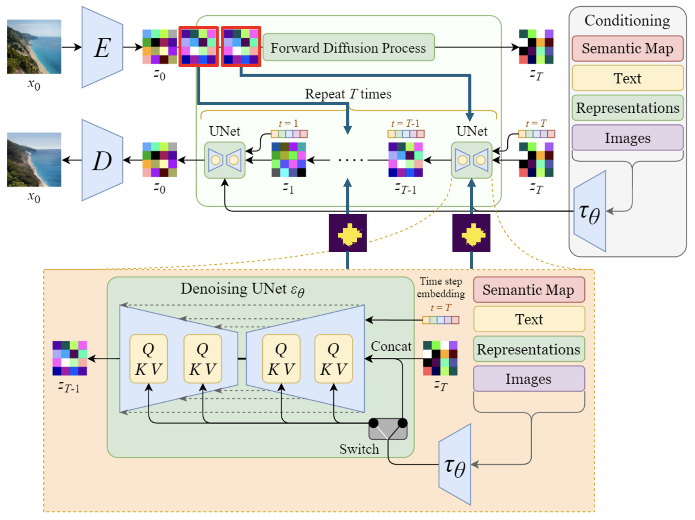
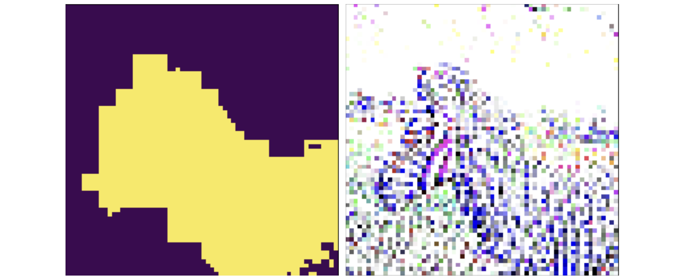

# Stable Diffusion Latent Manipulation
Giving individuals the ability to retain key features of image subjects while generating new, user-prompted backgrounds using Stable Diffusion.

## Introduction/Background
Diffusion models offer a unique approach to high-resolution image generation by leveraging text prompts and existing photos. However, existing architectures often struggle to maintain strong ties between the generated images and the input references. Recent research advancements have been able to produce scene changes in Stable Diffusion produced images using user prompts. However, this novel approach allows users to input their OWN images while still using the Stable Diffusion architechture for scene change tasks. This drastically expands the use cases of Stable Diffusion, as users can now generate new backgrounds to photo subjects that are important to them. For instance, given a photo of an individual's dog playing in a park, my manipulated Stable diffusion model allows the user to prompt a scene change while retaining the original dog in its active state. 

Given that you have the necessary spaCy libraries downloaded, this model works out-of-the-box with the jupyter notebook file "stable_diffusion_latent_manipulation.ipynb". 

## Methods
### Set Up
I pulled in my image dataset from https://cocodataset.org/, a widely recognized benchmark for object detection, segmentation, and captioning tasks in computer vision. I used the baseline Stable Diffusion model with codebase residing in the "stable_diffusion" folder. This codebase integrates the authentic weights of the stable diffusion model, sourced from Hugging Face’s repository. During preprocessing, I developed a pipeline which incorporates several crucial hyperparameters:
1. **Prompt (Text)**: Defines the subject details of the output image. In every use case I fix the prompt in a particular format:
< Subject > on < Scene >
2. **Input Image**: This is the original image the user gives the model as the reference to generate new images. This provides the subject which the user wants to retain in the generated image.
3. **Subject (Text)**: This is the subject of the image that the user wants to retain during Stable Diffusion.
4. **Noise Strength**: Determines the level of noise added to the latent vectors during generation, I experimented with values: 0.6, 0.7, 0.8, 0.9, 1.0 and and determined that 0.7 worked best. 
5. **Classifier-Free Guidance Scale**: Influences the strength of guidance provided to the diffusion model. I used 9 during my use cases.
6. **Inference Step Count**: Specifies the number of steps taken during the inference process. I used 50 steps.
7. **Seed Specifier**: Facilitates reproducibility of results by specifying a seed value.

### Approach
My approach entailed enhancing stable diffusion models for text-to-image synthesis by integrating dynamic masking techniques. The key innovation lies in leveraging cumulative attention scores derived from textual prompts to selectively preserve contextual information while generating visually coherent images. This novel approach aims to address the challenge of maintaining strong ties between generated images and input references, thus empowering users with greater control of the generative process. 

#### Caching
During ablation studies, I noticed the noised latent produced by forward diffusion ($z_\tau$) is not a good representation of the original image context. Per the modified Stable Diffusion architecture above, I cached specific latent vectors early in the noising process to retain key features of the original input image. During denoising, the cached latent vectors only replaced pixels defined as the subject by the mask at select timesteps. 
#### Masking
I visualized the noised latent vectors and corresponding masks at each manipulated timestep, determining the optimal threshold for the dynamic mask to balance context preservation and mask coverage. Instead of aggregating cross attention maps, I only masked the cross-attention map building the background scene (e.g. "beach" attention map given prompt "dog on beach"). We crafted a new formula and generated a hyperparameter to guide thresholding:

$$\text{masked attention map} > e^{\mu(\log (\text{subject attention latents})) + \lambda}$$

The figure below displays mask thresholding used to silhouette the user's subject and retain the context from the original image by choosing latent vectors in earlier stages of forward diffusion. This technique forced stable diffusion to account for subject features while also giving the model creative power to generate a new scene based on the prompt. 

Throughout development, we encountered challenges such as handling prompts with multiple subjects, determining the threshold for the dynamic mask, managing computational complexity, and conducting comprehensive evaluations. These challenges prompted iterative refinement of our approach and underscored the need for careful optimization and experimentation.

Our approach represents a significant advancement in the field of diffusion models for image generation, offering improved sample quality and greater user control. By systematically integrating dynamic masking techniques with stable diffusion models, we aim to enhance the accuracy and flexibility of text-to-image synthesis, opening avenues for diverse applications across various domains.
